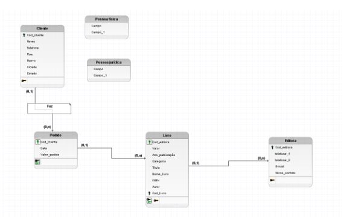
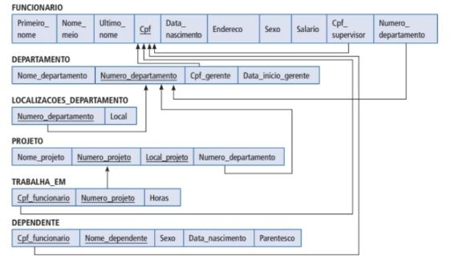

# Iniciando curso

O modelo lógico de dados é criado a partir das descrições dos dados representadas em um modelo conceitual. Ele descreve como os dados serão armazenados no banco de dados, identificando as entidades, os atributos, as chaves primárias e estrangeiras e os seus relacionamentos.

Há duas formas que podemos utilizar para representar o modelo lógico: a forma horizontal ou a forma vertical. Durante o curso foi utilizado a representação vertical, onde os atributos (que mais a frente serão chamados de campos) são representados um abaixo do outro, os atributos chaves são identificados e os relacionamentos são representados através de linhas ligando uma relação à outra:

Na forma horizontal, os atributos (campos) são apresentados um ao lado do outro, os atributos chave são sublinhados nas relações e os relacionamentos são representados através de uma seta, que sai da relação dependente e chega à relação proprietária. Já as cardinalidades não são representadas, como no exemplo a seguir:

As duas formas são válidas e podem ser utilizadas para representar o modelo lógico de dados. Normalmente a forma mais utilizada é a forma vertical, por ser semelhante a representação final das relações em um banco de dados.

### Modelo lógico

O nome que daremos para as entidades no modelo lógico é relação.

No brModelo ele trata o nome relação como nome de tabela, isso pode variar de software para software.

Aqui no modelo lógico vamos utilizar os nomes das tabelas com letra maiúscusla e o nome dos atributos como letra minúscula.

Os atributos no modelo lógicos vão receber o nome de campo.

As chaves pretas são as chaves primárias e as chaves verdes são as chaves estrangeiras.

